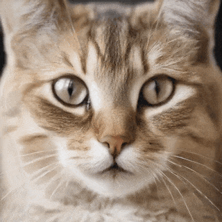
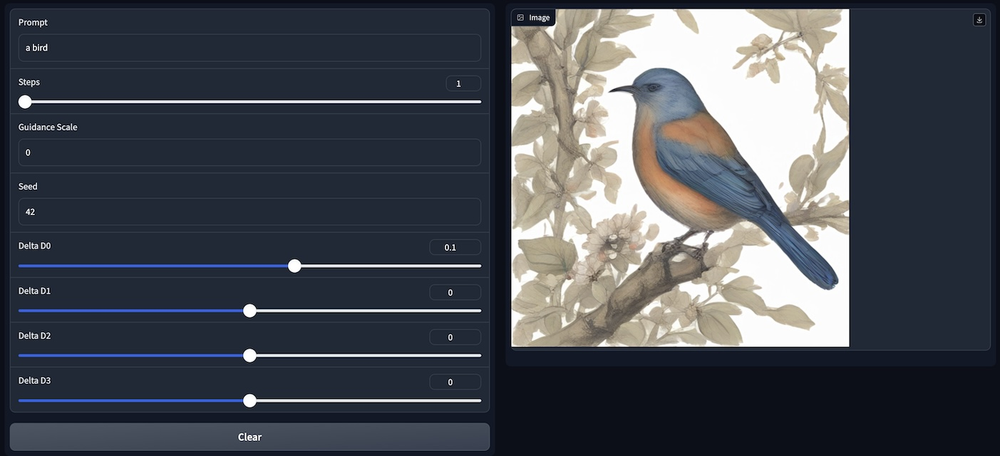

# Diffusion Playground

Experiments with image generation models.

## Installation

Please use a recent version of python (`3.11` recommended):

```
pip install -r requirements.txt
```

## Experiments

### Prompt Latent Walk



Generate latent walks in the prompt latent space.

[prompt-latent-walk.py](prompt-latent-walk.py)

### Noise Latent Walk
Initial implementation of initial noise latent walk.

[noise-latent-walk.py](noise-latent-walk.py)

### Latent Explorer Web



Explore the noise latent space with 4 sliders.

[latent-explorer-web.py](latent-explorer-web.py)

## About
Copyright (c) 2024 Florian Bruggisser