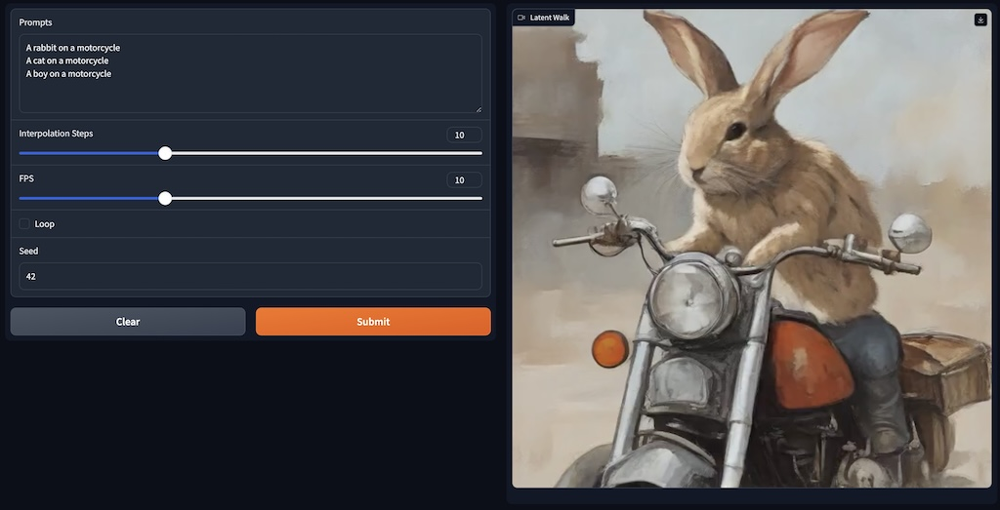

# Diffusion Playground

Experiments with image generation models. The experiments are mainly for
the [SDXL Turbo model](https://huggingface.co/stabilityai/sdxl-turbo), as it is more interesting to play with such a
reactive model.

## Installation

Please use a recent version of python (`3.11` recommended):

```
pip install -r requirements.txt
```

## Experiments

### Prompt Latent Walk


Generate latent walks in the prompt latent space.

```
python prompt-latent-walk.py
```

### Prompt Latent Walk Web



A webinterface to create latent walks.

```
python prompt-latent-walk-web.py
```

### Noise Latent Walk

Initial implementation of initial noise latent walk.

```
python noise-latent-walk.py
```

### Latent Explorer Web


Explore the noise latent space with 4 sliders.

```
python latent-explorer-web.py
```

## About

Copyright (c) 2024 Florian Bruggisser